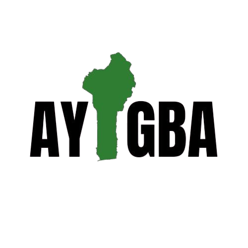

# 🏡 AYIGBA - Plateforme de Vérification Foncière

<div align="center">
  
  
  **La solution digitale qui sécurise vos biens fonciers au Bénin**
  
  [](https://nextjs.org/)
  [](https://www.typescriptlang.org/)
  [](https://tailwindcss.com/)
  [](https://react-leaflet.js.org/)
</div>

---

## 🎯 Qu'est-ce qu'AYIGBA ?

**AYIGBA** est une plateforme web révolutionnaire qui permet aux citoyens béninois de **vérifier instantanément** le statut juridique de leurs parcelles foncières. Fini les déplacements multiples, les longues attentes et l'incertitude ! En quelques clics, découvrez si votre terrain est en conflit et sécurisez vos investissements immobiliers.

### 🌟 Pourquoi AYIGBA ?

Au Bénin, **plus de 70% des litiges fonciers** auraient pu être évités avec une vérification préalable. AYIGBA démocratise l'accès à l'information cadastrale officielle de l'**Agence Nationale du Domaine Foncier (ANDF)** pour protéger vos droits de propriété.

### ✨ Simple comme bonjour !

1. **📤 Uploadez** votre levé topographique (photo ou PDF)
2. **⚡ Analysez** automatiquement contre 11+ bases de données officielles  
3. **📋 Obtenez** votre rapport de vérification certifié
4. **💡 Agissez** en toute connaissance de cause

---

## 🚀 Pour qui et pourquoi ?

### 👥 Qui peut utiliser AYIGBA ?

- **🏠 Propriétaires** - Vérifiez vos titres existants
- **🏗️ Investisseurs** - Sécurisez vos achats immobiliers  
- **🏢 Promoteurs** - Validez vos projets de construction
- **⚖️ Juristes** - Appuyez vos dossiers avec des preuves
- **🏛️ Notaires** - Accélérez vos transactions
- **👨‍💼 Particuliers** - Évitez les arnaques foncières

### 🎯 Cas d'usage concrets

#### 🏠 **Achat de terrain**
*"Je veux acheter ce terrain à Cotonou, est-il vraiment libre ?"*
→ Uploadez le plan, découvrez s'il y a des conflits avant de signer !

#### 🏗️ **Construction de maison**
*"Je commence ma construction, y a-t-il des restrictions ?"*
→ Vérifiez les zones protégées, domaines publics, et limitations d'usage !

#### ⚖️ **Résolution de litige**
*"Mon voisin prétend que mon terrain lui appartient"*
→ Obtenez un rapport officiel pour défendre vos droits !

#### 💰 **Investissement immobilier**
*"Ce terrain est-il un bon investissement ?"*
→ Analysez tous les risques juridiques avant d'investir !

---

## ✨ Fonctionnalités principales

### 🔍 **Vérification Intelligente**
- **Analyse OCR avancée** : Reconnaissance automatique des coordonnées
- **Géoréférencement précis** : Localisation exacte de votre parcelle
- **Détection de conflits** : Identification des superpositions à risque
- **11+ couches cadastrales** : Aires protégées, domaine public, zones litigieuses...

### 🗺️ Cartographie Interactive
- **Carte Leaflet** intégrée avec couches géospatiales
- **Visualisation des conflits** en temps réel
- **Légende interactive** des couches cadastrales
- **Zoom et navigation** fluides
- **Marker personnalisés** pour les zones d'intérêt

### 🤖 Assistant IA
- **Chatbot intelligent** avec reconnaissance vocale
- **Réponses contextuelles** sur le droit foncier béninois
- **Sources vérifiées** avec liens de référence
- **Questions prédéfinies** pour une aide rapide
- **Interface conversationnelle** moderne

### 📱 Experience Utilisateur
- **Design responsive** : Mobile-first, optimisé tablette/desktop
- **Animations fluides** : Mascotte interactive, micro-interactions
- **Feedback visuel** : Indicateurs de progression, états de chargement
- **Accessibilité** : WCAG 2.1, navigation clavier, contraste élevé

## 🛠️ Technologies

### Core Framework
- **Next.js 14.2.33** - Framework React avec App Router
- **TypeScript 5** - Typage statique
- **React 18** - Interface utilisateur

### Styling & UI
- **Tailwind CSS 4.1.9** - Framework CSS utilitaire
- **Radix UI** - Composants accessibles headless
- **Lucide React** - Icônes modernes
- **Tailwind Animate** - Animations CSS

### Cartographie & Géospatial
- **React Leaflet 4.2.1** - Cartographie interactive
- **Leaflet** - Bibliothèque de cartes open source
- **GeoJSON** - Format de données géospatiales

### Fonctionnalités Avancées
- **React Hook Form** - Gestion des formulaires
- **Zod** - Validation de schémas
- **Date-fns** - Manipulation de dates
- **Sonner** - Notifications toast

## 🚀 Installation

### Prérequis
- **Node.js** 18.17 ou supérieur
- **npm**, **yarn**, ou **pnpm**
- **Git**

### 1. Cloner le projet
```bash
# 1. Cloner le projet
git clone https://github.com/Ines-05/hackathonIA.git
cd hackathonIA

# 2. Installer les dépendances
npm install

# Avec yarn
yarn install

# Avec pnpm (recommandé)
pnpm install
```

### 3. Lancer le serveur de développement
```bash
npm run dev
# ou
yarn dev
# ou
pnpm dev
```

### 🌐 **Accès direct**
Visitez [https://ayigba-frontend.vercel.app](https://ayigba-frontend.vercel.app) pour tester immédiatement !

---

## 📱 Guide d'utilisation

### **Étape 1 : Upload de document**
- Glissez-déposez votre levé topographique
- Formats acceptés : PDF, JPG, PNG, JPEG
- Taille maximum : 10MB
- Qualité recommandée : Lisible, bien éclairé

### **Étape 2 : Analyse automatique**
- L'IA extrait les coordonnées automatiquement
- Vérification contre 11+ bases de données
- Détection des conflits potentiels
- Calcul des risques juridiques

### **Étape 3 : Résultats interactifs**
- Visualisation sur carte interactive
- Rapport détaillé des conflits
- Recommandations d'actions
- Export PDF officiel

### **Étape 4 : Actions recommandées**
- Contacter un notaire si nécessaire
- Régulariser les documents manquants
- Négocier en connaissance de cause
- Sécuriser votre investissement

---

## 🎯 Feuille de route

### **Version actuelle (v1.0)**
- ✅ Vérification basique de parcelles
- ✅ Cartographie interactive
- ✅ Assistant IA juridique
- ✅ Génération de rapports PDF

### **Prochaines fonctionnalités (v2.0)**
- 🔄 Alertes de changements cadastraux
- 📊 Historique des prix fonciers
- 🤝 Mise en relation avec experts
- 📱 Application mobile native
- 🔗 API pour partenaires

---

## 🤝 Communauté & Support

### **Besoin d'aide ?**
- 💬 **Chatbot intégré** : Assistant 24h/7j sur la plateforme
- 📧 **Email** : support@ayigba.bj
- 📞 **Téléphone** : +229 XX XX XX XX
- 📚 **Documentation** : Guide complet en ligne

### **Contribuer**
- 🐛 **Reporter un bug** : Issues GitHub
- 💡 **Suggérer une amélioration** : Feature requests
- 👨‍💻 **Développer** : Contributions code bienvenues
- 🎨 **Designer** : Améliorations UX/UI

---

## 📄 Mentions légales

### **Partenariat officiel**
AYIGBA est développé en partenariat avec l'**Agence Nationale du Domaine Foncier (ANDF)** du Bénin pour garantir l'authenticité et la fiabilité des données cadastrales.

### **Licence**
Projet sous licence MIT - Voir [LICENSE](LICENSE) pour les détails.

### **Données**
- Source officielle : ANDF Bénin
- Mise à jour : Trimestrielle
- Précision : ±2 mètres (GPS)
- Couverture : Territoire national

---

<div align="center">
  <h2>🌟 Révolutionnez votre approche du foncier !</h2>
  
  **Ne laissez plus l'incertitude guider vos décisions immobilières**
  
  [🚀 Tester maintenant](https://ayigba-frontend.vercel.app) • [📧 Nous contacter](mailto:contact@ayigba.bj) • [📖 Documentation](https://docs.ayigba.bj)
  
  ---
  
  *Développé avec ❤️ pour sécuriser le patrimoine foncier béninois*
  
  **AYIGBA** • *Votre terre, votre sécurité*
</div>